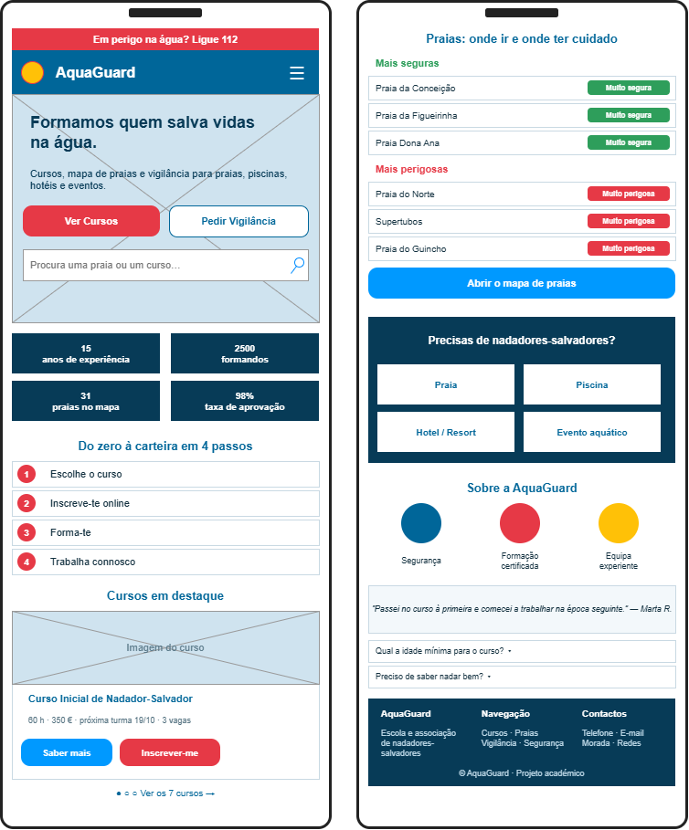
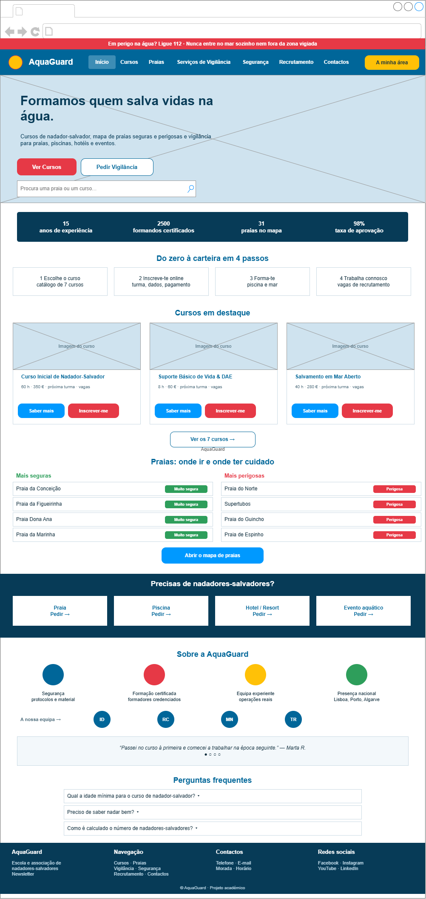
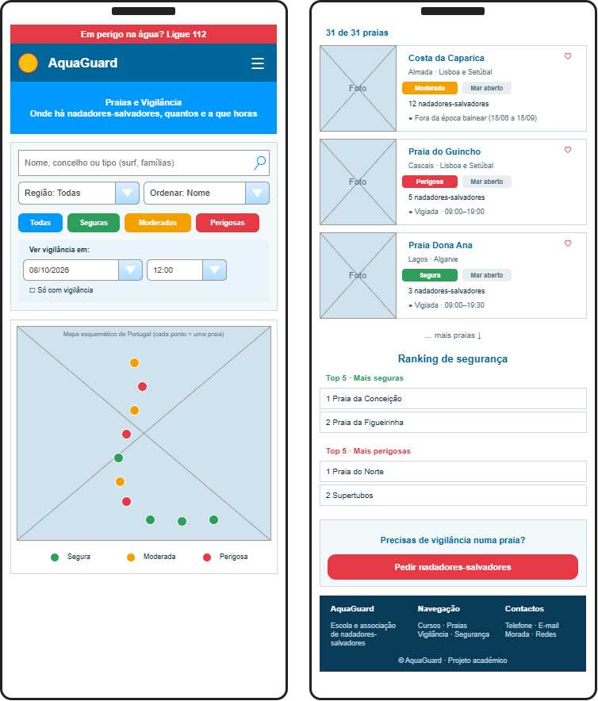
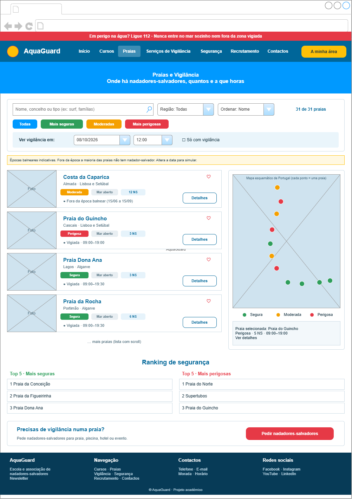

# AquaGuard: Escola e Associação de Nadadores-Salvadores

Website responsivo (mobile e desktop) de uma escola e associação de nadadores-salvadores.
Projeto da unidade curricular **Desenvolvimento para a Web**, Licenciatura em Ciência de Dados para a Gestão, 2026/2027.

## Grupo

- Manuel João Santos: 2024153226
- Tomás Abreu: 2024140672


## Para que serve

O site responde a três necessidades:

1. **Tirar um curso**: conhecer os cursos de salvamento aquático e primeiros socorros, ver turmas e vagas e inscrever-se online.
2. **Pedir nadadores-salvadores**: para praias, piscinas, hotéis e eventos, com sugestão do número de nadadores e orçamento em tempo real.
3. **Escolher uma praia segura**: consultar nadadores-salvadores, horários, perigos e quais as praias mais seguras e mais perigosas, num mapa de Portugal.

Navegação simples (1 a 3 cliques), menu fixo no topo, logótipo que volta sempre ao Início e botão "Voltar" em todas as subpáginas.

## Estrutura do website

```
Início ................ pesquisa, cursos e praias em destaque, sobre e FAQ
├── Cursos ............ catálogo, filtros e recomendador de curso
│    └── Detalhe ...... programa, requisitos, turmas e vagas
│         └── Inscrição  assistente em 3 passos (turma, dados, pagamento)
├── Praias ............ mapa de Portugal, filtros e rankings de segurança
│    └── Detalhe ...... nadadores, horários, perigos e planeador de visita
├── Serviços de Vigilância  tipos de serviço, preços e calculadora
│    └── Pedido ....... assistente em 4 passos com orçamento em tempo real
├── Segurança ......... bandeiras, correntes de retorno, SBV e quiz
├── Recrutamento ...... vagas, verificador de requisitos e candidatura
├── Contactos ......... morada, mapa e formulário
└── A minha área ...... inscrições, pedidos, candidaturas e praias favoritas
```

## Funcionalidades

**Básicas**
- Menu fixo, hambúrguer em mobile, botão "Voltar" em todas as subpáginas.
- Catálogo de cursos com filtros, detalhe (programa, requisitos, turmas, vagas) e inscrição com validação.
- Diretório de 31 praias com pesquisa e filtros por região e nível de risco.
- Mapa de Portugal com praias coloridas por risco e rankings das mais seguras e mais perigosas.
- Pedido de vigilância em 4 passos com orçamento em tempo real.
- Candidatura a vagas, formulário de contactos e área pessoal (guardada no navegador).

**Extras**
- Recomendador de curso, simulador de data/hora de vigilância e planeador de visita à praia.
- Conteúdos de segurança: bandeiras, corrente de retorno, sinais de afogamento, SBV, checklist e quiz.

**Possíveis evoluções**
- Dados reais das praias (APA/Infopraia), com bandeiras e condições do mar em tempo real.
- Backend e base de dados, e-mails de confirmação e pagamento online.
- Praias da Madeira e dos Açores e versão em inglês.

## Esquemas 

- Inicio . Mobile


- Inicio . Desktop


- Praias . Mobile


- Praias . Desktop


## Ficheiros

| Ficheiro | Conteúdo |
|---|---|
| `index.html` | Estrutura base, cabeçalho fixo e rodapé |
| `style.css` | Estilos e responsividade |
| `data.js` | Dados: praias, cursos, vagas, FAQ, quiz (editar aqui) |
| `core.js` | Utilitários, armazenamento local, ilustrações SVG e cálculos |
| `app.js` | Páginas, router por `#/rota` e interações |
| `mockups/` | Esquemas draw.io e PNG |
| `assets/logo.png` | Logótipo |
